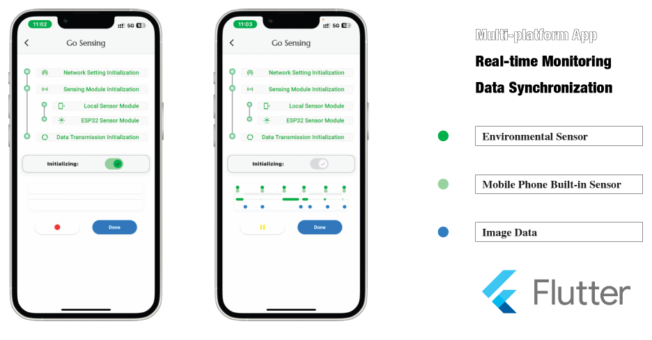

# GeoScanner: Your Complete Mobile Sensing Solution

**GeoScanner** is an all-in-one mobile sensing platform designed to empower individuals and organizations to monitor and analyze environmental conditions with precision and ease. 

  

From hardware setup to data visualization, GeoScanner provides a seamless experience, offering everything you need to get started with mobile environmental sensing.

  

## 🌐 Explore GeoScanner

- **Live Demo:** See GeoScanner Demo in  [YouTube video](https://www.youtube.com/watch?v=21nMIhI3E-U).
- **Project Website:** Visit the [project website](https://tianming-liu.github.io/GeoScanner/) to explore interactive maps and data visualizations.

## 🌟 Features

- **Sensing Hardware:** Includes the ESP32 microcontroller, BME680 sensor, and camera module for capturing a wide range of environmental data.
- **User-Friendly Mobile App:** Manage your sensing operations, view live data, and monitor your environment through an intuitive interface.
- **Seamless Data Integration:** Combines sensor data with image-based indicators, processed through advanced computer vision models.
- **Smart Route Planning:** Utilizes the Chinese Postman Problem algorithm to ensure optimal coverage of the sensing area.
- **Interactive Web Visualization:** Leverages Mapbox and D3.js to provide real-time data mapping and interactive charts.

## 🚀 Getting Started

1. **Hardware Setup:** Assemble your ESP32, BME680, and camera module following the instructions in the [hardware guide](hardware_guide.md).
2. **Mobile App:** Install the GeoScanner app on your smartphone to start collecting data. The app provides real-time monitoring and visualization.
3. **Deploy the Web Interface:** Use [GitHub Pages](https://tianming-liu.github.io/GeoScanner/) for seamless deployment of the web-based visualization platform.

## 🔧 How It Works

1. **Data Collection:** The GeoScanner hardware captures environmental data and images in real-time.
2. **Data Processing:** Sensor data and images are processed through cloud services, integrating various data sources.
3. **Visualization:** The processed data is visualized on a web interface, providing insightful trends and analytics.